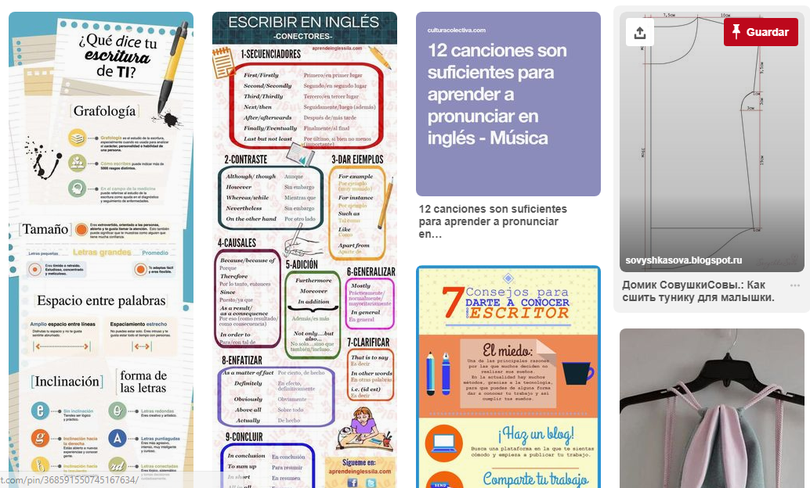

# Elementos de *UX* y *UI* en *PINTERES*

* Tenemos en primer lugar la parte gris con dos botones  

|   UX     |     UI |
| ---------|-------:|
|Al ingresar a la pagina nos pregunta al inicio |Se encarga de darle color y personalizar los botones     |
| La Navegación Global  con accesos mas faxtibles para el usuario como una mini imagen de su cuenta  |Los iconos corespondientes, sus colores, formas y la posición de cada una de ellas  |

* Tenemos en segundo lugar la parte del body

|   UX     |     UI |
| ---------|-------:|
| El se encarga en poner las tendencias| Se encarga de poner en forma lineal y accesible para el usuario combinando colores estrategicos|

# YOU TUBE

|   UX         |         UI |
| -------------|-----------:|
| Esta la Navegación Global con los accesos correspondientes para la comodidad del usuario|EL UI se encarga de acomodar los iconos y poner de forma estetica los accesos |
| Esta la navegación local que hace la busqueda mas rapida |El color del buscador y la posoición del buscador|

* En estas partes de la web Navegación Contextual

|   UX     |     UI |
| ---------|-------:|
| Crea mixes para cada usuario|Los videos los agrega de forma lineal|
|Determina por secciones| Agrega los videos|

* sección Recomendados

* Sección videos que no terminaron de ver

* Sección de videos recién subidas

* Sección de accesos directos 

*Yolanda Ventura Chavez*